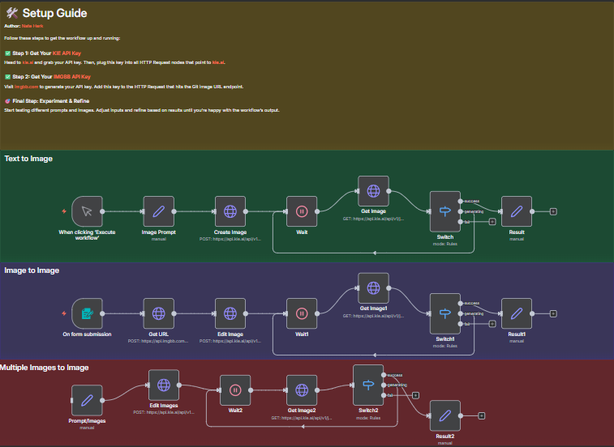

# Nano Banana Pro

An advanced n8n workflow for AI-powered image generation and manipulation using the Nano Banana Pro model. Create stunning 4K images from text prompts, transform existing images, or combine multiple images into creative compositions.

## Overview

This workflow leverages the Nano Banana Pro AI model through KIE.AI's API to provide three powerful image generation capabilities: text-to-image, image-to-image transformation, and multi-image composition. Perfect for content creators, designers, and marketers who need high-quality AI-generated visuals.

## Architecture

The system consists of three independent pipelines:

### Pipeline 1: Text to Image
1. **Manual Trigger** - Initiates the workflow
2. **Image Prompt** - Sets the text description
3. **Create Image** - Sends request to Nano Banana Pro API
4. **Wait** - Pauses for image generation
5. **Get Image** - Retrieves the generated image
6. **Switch** - Checks generation status (success/generating/fail)
7. **Result** - Outputs the final image URL

### Pipeline 2: Image to Image
1. **Form Submission** - Web form for image upload and prompt input
2. **Get URL** - Uploads image to IMGBB for hosting
3. **Edit Image** - Sends image and prompt to Nano Banana Pro
4. **Wait** - Pauses for image transformation
5. **Get Image** - Retrieves the edited image
6. **Switch** - Checks generation status
7. **Result** - Outputs the transformed image URL

### Pipeline 3: Multiple Images to Image
1. **Prompt/Images** - Sets prompt and multiple image URLs
2. **Edit Images** - Combines images based on prompt
3. **Wait** - Pauses for composition generation
4. **Get Image** - Retrieves the final composition
5. **Switch** - Checks generation status
6. **Result** - Outputs the composed image URL

## Components

### AI Service
- **KIE.AI** - Nano Banana Pro model API
- **IMGBB** - Image hosting service

### n8n Nodes
- Manual Trigger - Workflow initiation
- Form Trigger - Image upload interface
- HTTP Request (multiple) - API interactions
- Wait (3 instances) - Generation delays
- Switch (3 instances) - Status checking
- Set (multiple) - Data configuration

## Setup

### Prerequisites
- n8n instance (self-hosted or cloud)
- KIE.AI API key
- IMGBB API key
- Basic understanding of image prompts

### Configuration

1. **Get Your KIE.AI API Key**
   - Visit [kie.ai](https://kie.ai)
   - Sign up and generate your API key
   - Copy the API key for use in the workflow

2. **Get Your IMGBB API Key**
   - Visit [imgbb.com](https://imgbb.com/)
   - Create an account and generate an API key
   - Copy the API key for image hosting

3. **Update KIE.AI API Keys**
   - Open the "Create Image" HTTP Request node
   - Replace `Bearer YOUR API KEY` with your KIE.AI key
   - Repeat for "Edit Image" and "Edit Images" nodes
   - Update all "Get Image" nodes with the same key

4. **Update IMGBB API Key**
   - Open the "Get URL" HTTP Request node
   - Replace `YOUR API KEY` in the query parameter with your IMGBB key

5. **Customize Prompts**
   - Edit the "Image Prompt" node for text-to-image generation
   - Modify the "Prompt/Images" node for multi-image composition
   - Adjust aspect ratio, resolution, and output format as needed

## Usage

### Text to Image Generation
1. Click "Execute workflow" on the manual trigger
2. The default prompt generates: "A hyper-realistic image of the Chicago skyline at sunset"
3. Wait for the image to generate (typically 10-30 seconds)
4. The final image URL appears in the Result node
5. Customize the prompt in the "Image Prompt" node for different images

### Image to Image Transformation
1. Access the form trigger webhook URL
2. Enter your transformation prompt (e.g., "Make this image look like a watercolor painting")
3. Upload your source image
4. Submit the form
5. Wait for the transformation to complete
6. Retrieve the edited image URL from the Result node

### Multiple Images Composition
1. Update the "Prompt/Images" node with:
   - Your creative prompt describing the desired composition
   - URLs of 2-3 images you want to combine
2. Execute the workflow
3. Wait for the AI to compose the images
4. Get the final composition URL from the Result node

## Example Use Cases

### Text to Image
**Prompt:** "A hyper-realistic image of the Chicago skyline at sunset"
**Output:** 4K PNG image of Chicago skyline

### Image to Image
**Prompt:** "Transform this photo into a cyberpunk style"
**Input:** Portrait photo
**Output:** Cyberpunk-styled version of the portrait

### Multiple Images Composition
**Prompt:** "A hyper-realistic image of a man wearing the shirt provided in the image. He is hiking on a mountain and is holding the water bottle provided in the image. He is also wearing the watch provided in the image."
**Inputs:** 
- Shirt image URL
- Water bottle image URL
- Watch image URL
**Output:** Composite image of a man hiking with all three products

## Configuration Options

### Image Parameters
- **aspect_ratio**: "1:1", "16:9", "9:16", "4:3", "3:4"
- **resolution**: "4K", "2K", "1080p", "720p"
- **output_format**: "png", "jpg", "webp"

### Model
- **nano-banana-pro**: High-quality image generation model

## Features

- **High-resolution output** up to 4K quality
- **Multiple generation modes** (text-to-image, image-to-image, multi-image)
- **Web-based upload interface** for easy image submission
- **Automatic status checking** with retry logic
- **Flexible aspect ratios** for different use cases
- **PNG output format** for transparency support
- **Real-time generation tracking** with wait nodes

## Status Handling

The workflow uses Switch nodes to handle three generation states:

- **Success**: Image generated successfully → Output result
- **Generating**: Still processing → Loop back to wait and check again
- **Fail**: Generation failed → Stop workflow

## Best Practices

1. **Prompt Engineering**: Be specific and descriptive in your prompts
2. **Image Quality**: Use high-quality source images for best results
3. **API Limits**: Monitor your KIE.AI API usage and quotas
4. **Wait Times**: Adjust wait node duration based on typical generation times
5. **Error Handling**: Check the fail output for troubleshooting
6. **Image URLs**: Ensure image URLs are publicly accessible

## Troubleshooting

**Images not generating?**
- Verify KIE.AI API key is valid and has credits
- Check that the API endpoint URLs are correct
- Ensure your prompt follows model guidelines

**Image upload failing?**
- Confirm IMGBB API key is correct
- Check that uploaded images are in supported formats (JPG, PNG)
- Verify image file size is within IMGBB limits

**Generation stuck in "generating" state?**
- Increase wait node duration
- Check KIE.AI service status
- Verify API rate limits haven't been exceeded

**Switch node not routing correctly?**
- Confirm the status field path is correct: `$json.data.state`
- Check API response format matches expected structure

## API Endpoints

### KIE.AI Endpoints
- **Create Task**: `POST https://api.kie.ai/api/v1/jobs/createTask`
- **Get Status**: `GET https://api.kie.ai/api/v1/jobs/recordInfo?taskId={taskId}`

### IMGBB Endpoint
- **Upload Image**: `POST https://api.imgbb.com/1/upload?key={apiKey}`

## Workflow Tags
- AI IMAGE GENERATION
- TEXT TO IMAGE
- IMAGE EDITING
- NANO BANANA PRO

## Credits

**Author:** [Nate Herk](https://www.youtube.com/@nateherk)

## Documentation

For additional information, refer to:
- Workflow diagram: `1.png`
- Workflow definition: `Nano Banana Pro.json`
- [KIE.AI Documentation](https://kie.ai)
- [IMGBB API Documentation](https://api.imgbb.com/)

## License

This project is provided as-is for educational and development purposes.
